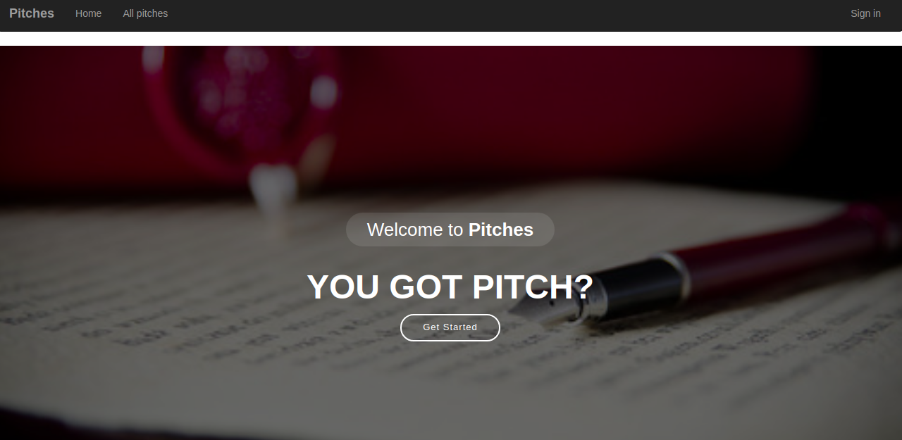

### Pick Up Lines

*By Cecilia Barasa*

## Description

This is a flask application that allows users to post a pitch with any category of which he/she must sign up to do so.

# Preview

# User Stories

As a user, you will be able to;
`see the pitches other people have posted.`
`vote on the pitch they liked and give it a downvote or upvote.`
`sign in for me to leave a comment`
`receive a welcoming email once I sign up.`
`view the pitches I have created in your profile page.`
`comment on the different pitches and leave feedback.`
`submit a pitch in any category.`
`view the different categories.`

## BDD
| Behavior | Input | Output |
| -------- | -------- | -------- |
| Load page    | On page load     | View all pitches and sign up    |
| On sign up    | Email,Username and password   | Redirect to login   |
| Select login    | Email and password     | Redirect to page with app pitches based on categories and commenting section    |
| Select comment button    | Comment   | Form that you input your comment   |

## Technologies Used
* `Python3.6`
* `Flask`

### 

## [Support and contact details](https://www.linkedin.com/in/cecilia-barasa-4a8311195/)